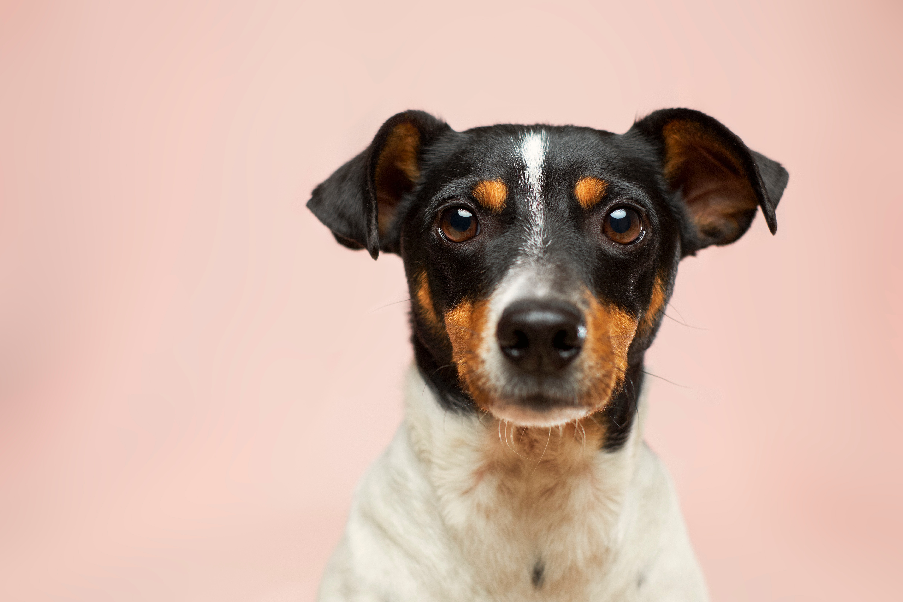

# Image Processing Project: Grayscale Conversion and Resampling

## Overview

This project demonstrates converting a color image to grayscale and resampling it using linear interpolation methods.

## Requirements

- Python 3.x
- OpenCV (`cv2`)
- NumPy

Install the required packages with:
pip install opencv-python numpy

## Usage

1. Place the input image file (`dog.jpg`) in the project directory.
2. Run the script `image_processing.py`.
3. Output images generated:
   - `gray_scale_dog.jpg`: Grayscale image.
   - `down_sampled_gs_dog.jpg`: Downsampled (70% of original size) grayscale image.
   - `reconstructed_gs_dog.jpg`: Reconstructed image resized back to original dimensions.

## Results
- **Original Image**
  

- **Grayscale Image**
  

- **Downsampled Image**
  

- **Reconstructed Image**
  

## Conclusion

This project illustrates basic image processing techniques, including grayscale conversion and image resampling.
